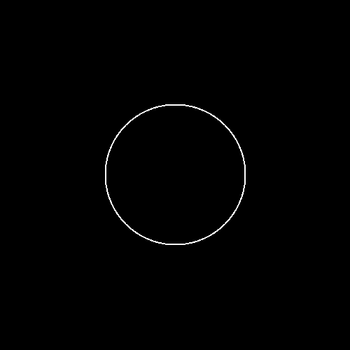
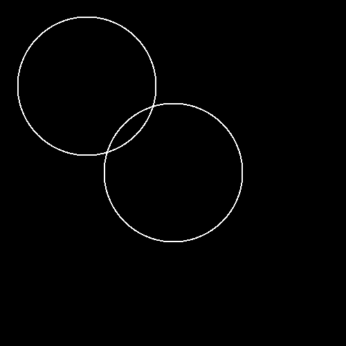
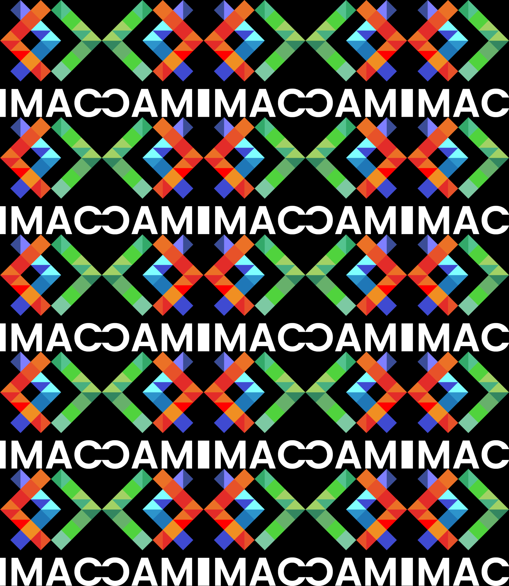

# 🐣 Rapport de Christian et Théo

- [🐣 Rapport de Christian et Théo](#-rapport-de-christian-et-théo)
  - [NIVEAU 1](#niveau-1)
    - [Ne gardez que le vert](#ne-gardez-que-le-vert)
    - [Échanger les canaux](#échanger-les-canaux)
    - [Noir \& Blanc](#noir--blanc)
    - [Négatif](#négatif)
    - [Dégradé](#dégradé)
  - [NIVEAU 2](#niveau-2)
    - [Miroir](#miroir)
    - [Image bruitée](#image-bruitée)
    - [Rotation de 90°](#rotation-de-90)
    - [RGB split](#rgb-split)
    - [Luminosité](#luminosité)
  - [NIVEAU 3](#niveau-3)
    - [Disque](#disque)
      - [Cercle](#cercle)
      - [Rosace](#rosace)
    - [Mosaïque](#mosaïque)
      - [Mosaïque miroir](#mosaïque-miroir)
    - [Glitch](#glitch)
    - [Fractale de Mandelbrot](#fractale-de-mandelbrot)
    - [Vortex](#vortex)
    - [Tramage](#tramage)
    - [Normalisation de l'histogramme](#normalisation-de-lhistogramme)
  - [NIVEAU 4](#niveau-4)
    - [Convolutions](#convolutions)
      - [Netteté, Contours, etc.](#netteté-contours-etc)
      - [Filtres séparables](#filtres-séparables)
      - [Différence gaussienne](#différence-gaussienne)
    - [Tri de pixels](#tri-de-pixels)
  - [NIVEAU 5](#niveau-5)
    - [Filtre de Kuwahara (effet peinture à huile)](#filtre-de-kuwahara-effet-peinture-à-huile)

## NIVEAU 1

### Ne gardez que le vert

| | |
|:--------------------------:|:--------------------------------:|
|            Avant           |               Après              |

**Méthode :** On parcourt un à un tous les pixels de l'image, puis on fixe la valeur du rouge et du bleu à 0 pour chacun d'entre eux : seuls le vert et le noir ressortent donc.

### Échanger les canaux

| | |
|:--------------------------:|:----------------------------------:|
|            Avant           |                Après               |

**Méthode :** On sélectionne tous les pixels un par un de la même manière que pour l'exercice précédent, sauf qu'on échange cette fois-ci les valeurs de rouge et de bleu pour chacun d'entre eux grâce à un *swap*.

### Noir & Blanc

| | |
|:--------------------------:|:--------------------------------:|
|            Avant           |               Après              |

**Méthode :** On attribue à chaque pixel la moyenne de ses valeurs de rouge, de vert et de bleu de sorte à obtenir une image colorée en niveaux de gris.

### Négatif

| | |
|:--------------------------:|:-----------------------------------:|
|            Avant           |                 Après               |

**Méthode :** On parcours tous les pixels, puis on obtient de nouvelles valeurs de rouge, de vert et de bleu pour chacun d'entre eux en soustrayant à 1 les valeurs d'origine.

### Dégradé

| | |
|:--------------------------:|:--------------------------------:|
|            Avant           |               Après              |

**Méthode :** On parcourt les colonnes une à une. Pour chacune d'entre elles, on définit une valeur allant du noir au blanc en fonction de la position du *x* sur la largeur totale de l'image.

**Piège :** Il faut bien penser à convertir les *x* en *float* grâce à un *static_cast* pour définir les niveaux de gris.

---

## NIVEAU 2

### Miroir

| | |
|:--------------------------:|:----------------------------------:|
|            Avant           |                Après               |

**Méthode :** On parcourt les pixels à *x* distance de l'extrémité gauche de l'image pour les échanger avec ceux à *x* distance de la droite (*image.width() - 1 - x*).

**Piège :** Il faut seulement parcourir la moitié gauche (*image.width()/2*) de l'image : on échangerait sinon des pixels déjà déplacés.

### Image bruitée

| | |
|:--------------------------:|:----------------------------------:|
|            Avant           |                Après               |

**Méthode :** Pour chaque pixel, on génère un nombre aléatoire allant de 0 à *n*, *n* étant inversement proportionnel à la quantité de bruit que l'on désire. Si *n* = 0, alors les valeurs de rouge, de vert et de bleu du pixel sélectionné prennent une valeur aléatoire comprise entre 0 et 1 pour générer une nouvelle couleur.

### Rotation de 90°

| | |
|:--------------------------:|:------------------------------------:|
|            Avant           |                 Après                |

**Méthode :** On crée une nouvelle image aux proportions inversées, puis on parcourt l'image d'origine pour copier ses pixels sur la nouvelle image en appliquant la rotation.

**Piège :** Puisqu'on parcourt les pixels de l'image d'origine de coordonnées *{x, y}*, il faut donc copier ceux de coordonnées *{x, image.height() - y - 1}* (à cause de la rotation) aux points *{y, x}* sur la nouvelle image (à cause d'inversion de proportions).

### RGB split

| | |
|:--------------------------:|:---------------------------------:|
|            Avant           |                Après              |

**Méthode :** On crée une nouvelle image sur laquelle on va copier les pixels de l'image d'origine en décalant certaines couleurs.

**Piège :** Il faut prendre en compte les dépassements et gérer donc les cas où on demanderait à un pixel de prendre la couleur d'un autre qui serait en dehors de l'image.

### Luminosité

| | | |
|:---------------------------:|:-------------------------------------:| :-----------------------------------: |
|            Normal           |                Éclairci               |                Assombri               |

**Méthode :** On parcourt les pixels un à un pour :
- augmenter leurs valeurs de rouge, de vert et de bleu grâce à une puissance supérieure à 1 ;
- diminuer ces valeurs à l'aide d'une puissance comprise entre 0 et 1.

---

## NIVEAU 3

### Disque

**Méthode :** On sélectionne chaque pixel de l'image et on calcule la distance qui le sépare du centre. Si cette distance est égale ou inférieure au rayon du disque alors on rend le pixel blanc.

#### Cercle

**Méthode :** On reprend le même principe que pour l'exercice précédant, sauf que la distance séparant le pixel du centre doit être comprise entre *rayon* et *rayon + thickness*.

#### Rosace

**Méthode :** On trace le premier cercle au centre de l'image, puis on trace les autres autour de celui-ci en transformant leurs origines respectives de coordonnées (*x*, *y*) sous la forme (*r cos(angle)*, *r sin(angle)*). La valeur des angles est définie par une boucle : *angle = 2 i pi / 6*.

**Piège :** En passant de coordonnées cartésiennes à coordonnées polaires, il ne faut pas oublier de resituer celles-ci par rapport au centre de l'image. Par exemple, `center_x = image.width()/2 + r cos(angle)`.

### Mosaïque

**Méthode :**

**Piège :** Si t'en trouves

#### Mosaïque miroir

**Méthode :**

**Piège :** Si t'en trouves

### Glitch

| | |
|:--------------------------:|:--------------------------------:|
|            Avant           |               Après              |

**Méthode :** A chaque pixel, on génère un nombre aléatoire compris entre 1 et *n*. Si *n = 0*, alors on sélectionne un second pixel aléatoirement qui sert de base pour créer un rectangle aux dimensions elles-aussi aléatoires. On échange ensuite les pixels de ce rectangle avec le pixel d'origine et ses voisins.

**Piège :** Il faut gérer les dépassements pour que le rectangle formé n'aille pas au-delà des extrémités de l'image.

### Fractale de Mandelbrot

**Méthode :** A chaque pixel, on associe un nombre complexe *x + iy* qu'on place ensuite dans un intervalle compris entre -2 et 2. On crée ensuite une boucle qui itère *n* fois `i++` et `z = z * z + c`. Si *abs(z)* ne dépasse jamais 2 d'ici la fin de la boucle (quand *i = n*), alors le pixel associé devient noir. Sinon, les niveaux de rouge, de vert et de bleu du pixel parcouru prennent la valeur *i/n*.

**Piège :** Il faut convertir *x* et *y* en *float* lorsque qu'on place les nombres complexes dans un intervalle compris entre -2 et 2.

### Vortex

| | |
|:--------------------------:|:--------------------------------:|
|            Avant           |               Après              |

**Méthode :**

**Piège :** Si t'en trouves

### Tramage

| | jp|
|:--------------------------:|:--------------------------------:|
|            Avant           |               Après              |

**Méthode :** 

**Piège :** Si t'en trouves

### Normalisation de l'histogramme

| | |
|:--------------------------:|:--------------------------------:|
|            Avant           |               Après              |

**Méthode :** On parcourt une première fois l'image pour trouver le pixel le moins lumineux et le pixel le plus lumineux. Après avoir transformé la courbe de l'histogramme en fonction affine, on peut ensuite parcourir une seconde fois l'image cette fois-ci en modifiant les valeurs.

---

## NIVEAU 4

### Convolutions

| | |
|:--------------------------:|:--------------------------------:|
|            Avant           |               Après              |

**Méthode :**

**Piège :** Si t'en trouves

#### Netteté, Contours, etc.

| | |
|:--------------------------:|:--------------------------------:|
|            Avant           |               Après              |

**Méthode :**

**Piège :** Si t'en trouves

#### Filtres séparables

| | |
|:--------------------------:|:--------------------------------:|
|            Avant           |               Après              |

**Méthode :**

**Piège :** Si t'en trouves

#### Différence gaussienne

| | |
|:--------------------------:|:--------------------------------:|
|            Avant           |               Après              |

**Méthode :**

**Piège :** Si t'en trouves

### Tri de pixels

| | |
|:--------------------------:|:--------------------------------:|
|            Avant           |               Après              |

**Méthode :** On crée une fonction mesurant la luminosité d'un pixel puis on ordonne les images du début à la fin par luminosité décroissante.

**Remarque :** Il nous reste à adapter la fonction pour trier les pixels horizontalement.

---

## NIVEAU 5

### Filtre de Kuwahara (effet peinture à huile)

| | |
|:--------------------------:|:--------------------------------:|
|            Avant           |               Après              |

**Méthode :**

**Piège :** Si t'en trouves